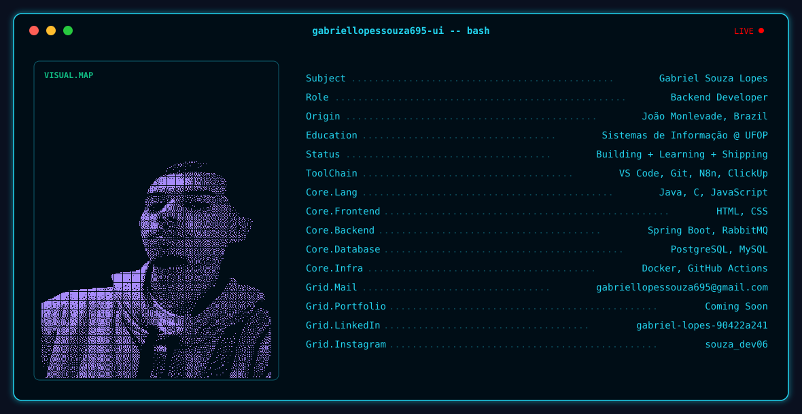

  <!-- FASE 1: BANNER -->
  <picture>
    <source media="(prefers-color-scheme: dark)" srcset="./dark.svg">
    <source media="(prefers-color-scheme: light)" srcset="./light.svg">
    
  </picture>

 

<!-- FASE 2: STATS CARDS -->

  

  
  

 

<!-- FASE 3: SNAKE ANIMATION -->

  <picture>
    <source media="(prefers-color-scheme: dark)" srcset="https://raw.githubusercontent.com/gabriellopessouza695-ui/gabriellopessouza695-ui/output/github-contribution-grid-snake-dark.svg">
    <source media="(prefers-color-scheme: light)" srcset="https://raw.githubusercontent.com/gabriellopessouza695-ui/gabriellopessouza695-ui/output/github-contribution-grid-snake.svg">
    
  </picture>

 

<!-- FASE 4: SOCIAL BADGES -->

  
  &nbsp;&nbsp;
  
  &nbsp;&nbsp;
  

